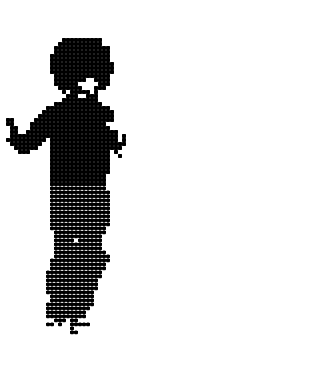

<h1 align="center"><pre>Hallo !</pre></h1>

><pre>Hi! It's R Sadhukhan.

 
<h2 align="center"></h2>

<h6 align="center"></h6>

> ## Current Projects

 

 

<h2 align="center"><pre>Reach Me On</pre></h2>

> ## Open Source Working Motto
<pre>
''Nothing is more powerful than Open Source.''
</pre>

> ## Catchphrase
<pre>
Prodigal Son
</pre>
----------------------------------------

